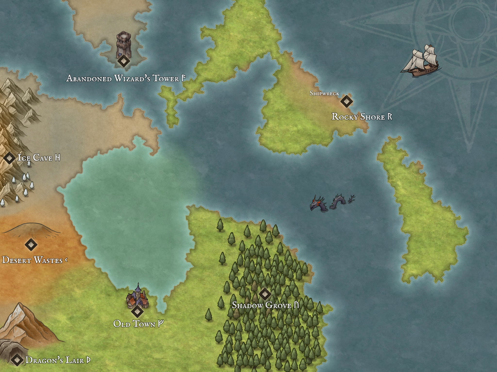
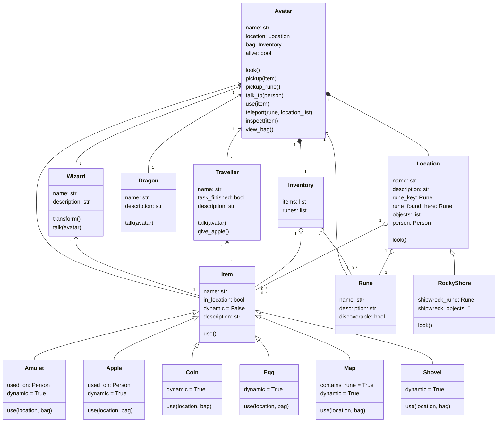

# User Documentation
## The Enchanted Lands
*Journey through the Enchanted Lands as you venture on a quest to uncover the whereabouts of the lost dragons.
Collect Runes that allow you to teleport around the world as you complete quests to get to your final destination.*
## Rules
Use commands to perform actions
- `look` - look around your current location
- `inspect <item>` - look at an item
- `use <item>` -use an item
- `pick up <item>` - pick up an item
- `talk to <person>` - talk to person
- `teleport <rune>` - teleport to the corresponding location on the map
- `view bag` - view the items in your bag

## Game Play
As you traverse the world you will pick up items that can be used to complete mini quests that give Runes (some runes
are simply laying on the ground waiting for you to pick up). Runes can then be used to teleport around the world. Each 
rune corresponds to a specific location on the map.

## Software Needed
- Python
- PIL (Python Imaging Library)

# Developer Documentation
## Files
- theEnchantedOnes
  - classes 
      - amulet.py
      - apple.py
      - avatar.py
      - coin.py
      - dragon.py
      - egg.py
      - inventory.py
      - item.py
      - location.py
      - map.py
      - rocky_shores.py
      - rune.py
      - shovel.py
      - traveller.py
      - wizard.py
  - images
    - enchanted_lands.jpg
  - main.py
  - setup.py
  - startup_screen.py
  - ReadMe.md

## User requirements and specifications
The application must feature; 
- a minimum of 10 different locations
- a method of teleporting between locations
- runes corresponding to each location
- ten items, five of which are non-static
- the ability to pick up/inspect/use items
- three characters
- the ability to interact with characters
- a map which can be viewed
- a readable list of places visted/not visited
- an inventory listing all items currently in a player's possession
- missions that are completed by collecting items
- a final goal/mission

## Class diagram
